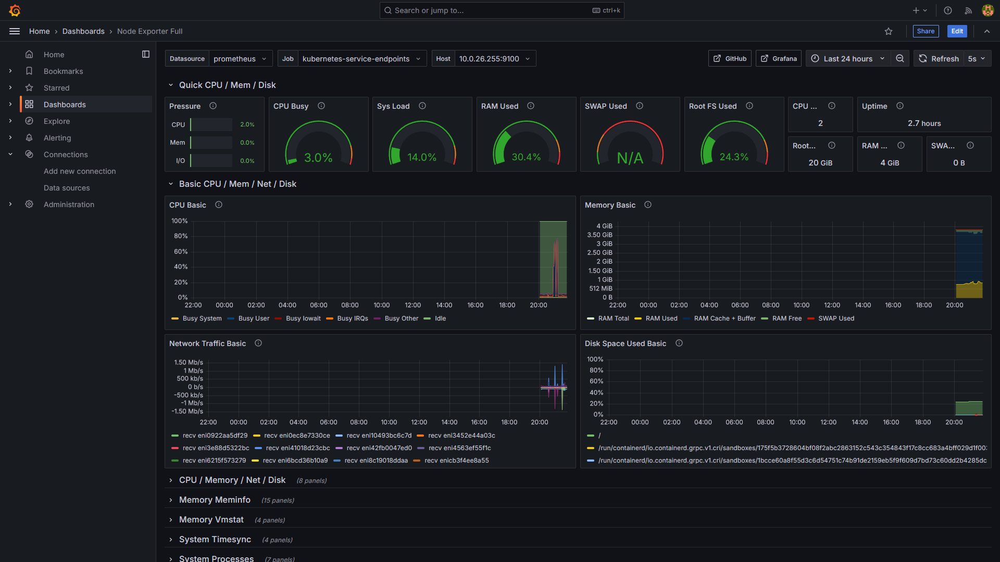
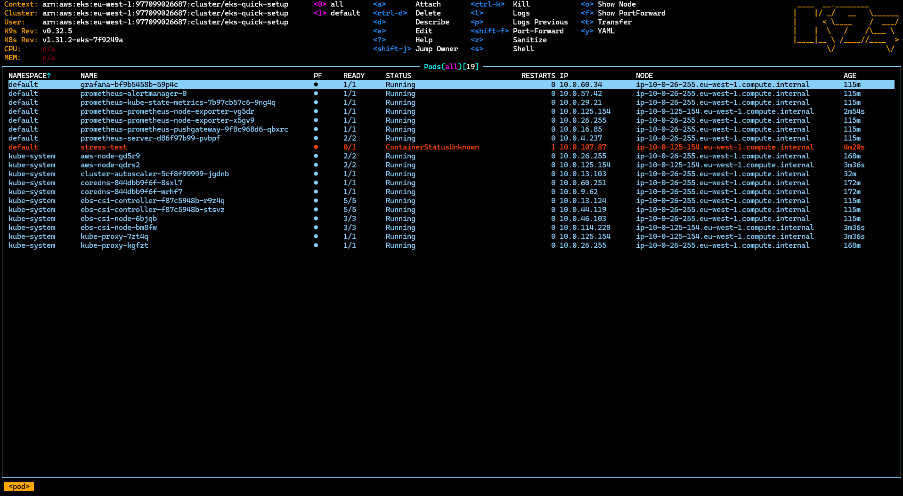
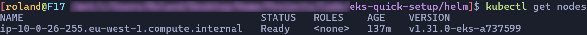
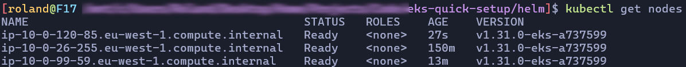
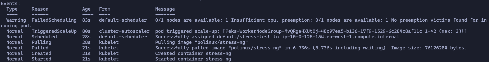
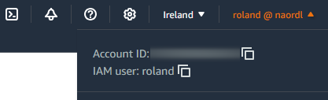
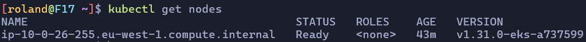
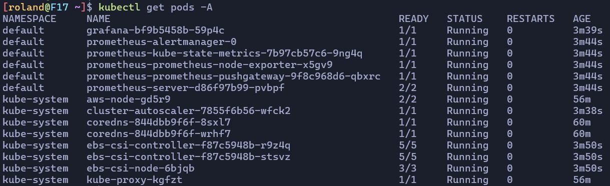

# EKS Quick Setup

## Introduction

This project serves as a quick and easy way of deploying a Kubernetes cluster on Amazon EKS. It includes the necessary template files, as well as a setup script which installs `Prometheus` and `Grafana` onto the cluster using the `Helm` package manager. In addition to this, the setup script also installs a pre-configured `Autoscaler`.

## Screenshots

### Grafana



### k9s



### Autoscaler





## Step-By-Step Guide

### Prerequisites

You will need an IAM user which has the necessary permissions to deploy CloudFormation stacks, as well an AWS CLI access key set up. This is necessary in order to have access to the cluster from the `kubectl` and `k9s` CLI utilities.

During the creation of the pipeline stack, the console will ask you for a GitHub OAuth Token. This is necessary in order to authorize AWS CodePipeline to monitor the GitHub repository for changes.

### First steps

Fork this repository.

Make the necessary changes to the template files:

In `eks-quick-setup-pipeline.yaml`:

- `GitHubOwner`, `GitHubRepo`, `ApplicationStackName` (if desired), `TemplateName` (if desired), `IAMUserName` variables may all be altered accordingly.

In `eks-quick-setup.yaml`:

- `ProjectName`, and anything else desired.

I would recommend keeping the AWS CloudFormation stack names, the variable names inside the `.yaml` files, as well as the `.yaml` file names themselves **consistent**, in order to avoid any confusion.

### Deployment

We are using AWS CodePipeline for CI/CD. For this reason, make sure to deploy `eks-quick-setup-pipeline.yaml` template **first**, which will automatically deploy the stack.

Once both the Pipeline and the EKS stacks are deployed, we need to update our `kubeconfig` in order to get access to the cluster:

```
$ aws eks update-kubeconfig --region eu-west-1 --name eks-quick-setup --role-arn arn:aws:iam::xxxxxxxxxxxx:role/eks-quick-setup-pipeline-CloudformationRole
```

Change the `region`, `name`, and `role-arn` arguments accordingly. The variable `xxxxxxxxxxxx` represents your Account ID, which you may obtain from the AWS management console:



Now we can use the `kubectl` CLI utility to manage our cluster. Let us query the active nodes:

```
$ kubectl get nodes
```



### Installing helm-charts

Our worker node(s) are active, but we aren't running any pods yet.

Run the setup script to install `autoscaler`, `prometheus`, and `graphana`.

You will need Docker for this step:

```
$ cd helm
$ docker-compose build
$ docker-compose up
```

If you see the error message

```
Error: Unable to retrieve stack names. Please check stack naming conventions or region.
```

it means you have altered the naming conventions or the region. Edit the `helm/setup.sh` bash script directly, and make the necessary changes before trying again.

If the script completed successfully, you should see the following message:

```
eks-helm-deployer exited with code 0
```

We can double check by querying the pods on our cluster:

```
$ kubectl get pods -A
```



If you changed the naming conventions, you will have to update the name of the EKS cluster inside the `helm/autoscaler/autoscaler.yaml` file.

### Configuring Grafana and Prometheus

Get the URL of the LoadBalancer which is assigned to Graphana with the following command:

```
$ kubectl get svc grafana
```

Look for the `EXTERNAL-IP` field and visit the address inside your browser.

Get the auto-generated admin password for Graphana with the following command:

```
$ kubectl get secret grafana -o jsonpath="{.data.admin-password}" | base64 --decode ; echo
```

**DO NOT SHARE THIS PASSWORD!**

Log into Graphana using the credentials:

- Username: admin
- Password: from the command above

On the sidebar, navigate to `Connections -> Data sources -> Add data source`, and choose `Prometheus` from the list.

We can get the `Prometheus server URL` by running the following command:

```
$ kubectl get svc prometheus-server
```

Look for `CLUSTER-IP` and paste it into the field, like so:

```
http://<CLUSTER-IP>:80
```

Click `Save & test` on the bottom.

In order to add a dashboard, on the left sidebar navigate to `Dashboards -> New -> Import`, and paste the dashboard ID you would like to use (for example, `1860`).

Click on `Load`, on the bottom you can select your `Prometheus` data source which you have just created, and click on `Import`.

### Stress testing the cluster

In order to perform a stress test on the cluster, we can deploy the `stress-test.yaml` pod by running the following command:

```
$ kubectl apply -f stress-test.yaml
```

You may customize the file to fit the size of your instances.

Confirm the pod exists and is running:

```
$ kubectl get pods
```

By default, it should start as `STATUS: pending`, and switch to `STATUS: running`.

We can observe the cluster scaling up by monitoring our nodes:

```
$ kubectl get nodes -w
```

After it completes, it should have `STATUS: completed`, and can be safely removed with the command:

```
$ kubectl delete pod stress-test
```

Done!
